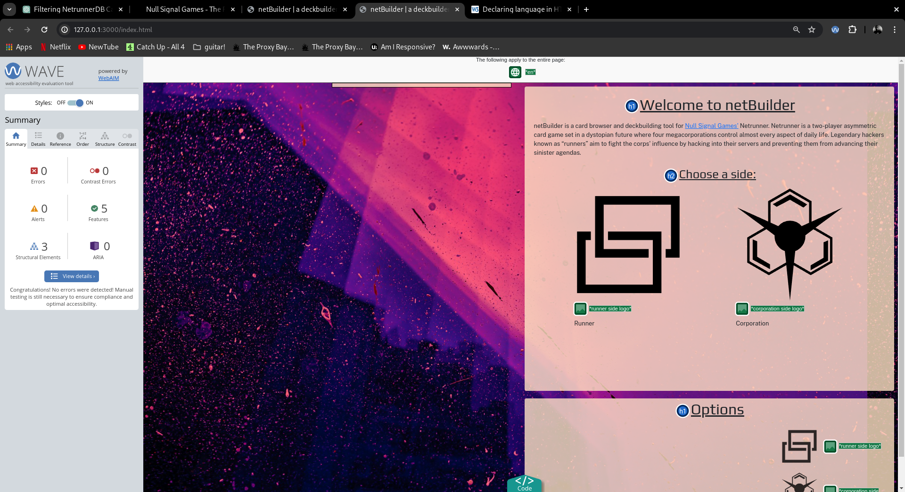
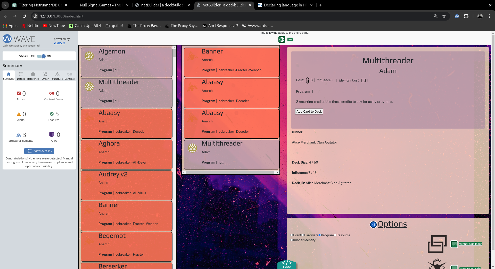
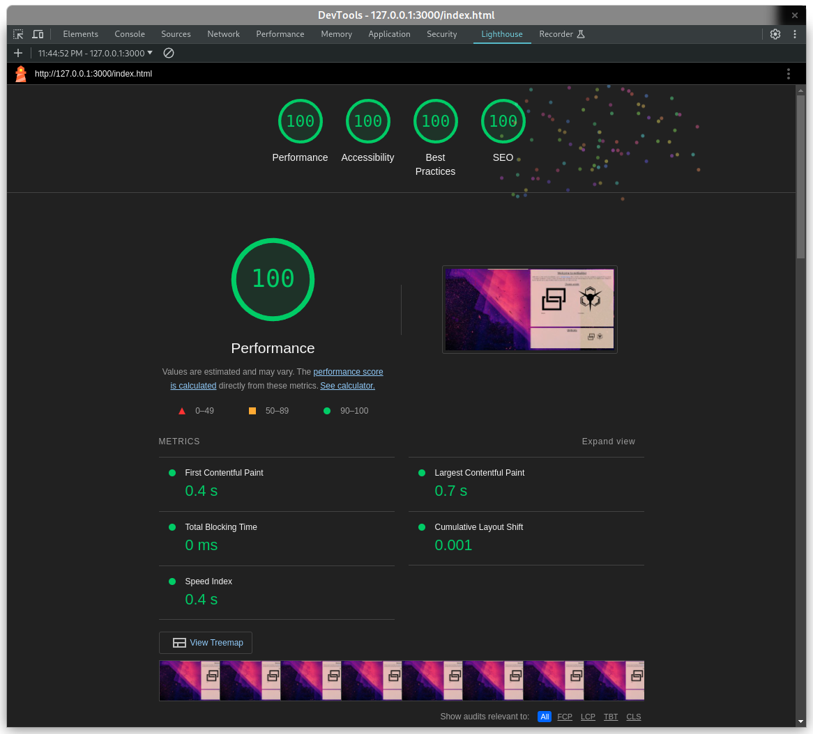

# Milestone Project :two:

[LIVE SITE](https://Oxymetaphoric.github.io/milestone_project_2/index.html)

---

## :world_map: Strategy

---

### Project Goals

This is my milestone two project for the [Code Institute's](http://www.codeinstitute.net/) *'Level 5 Diploma in Web Application Development'*. The goal of this project is to *Design, develop and implement a dynamic Front end web application using HTML, CSS and JavaScript*. To this end I am building a website that will connect to the [Netrunner Database](http://www.netrunnerdb.com) API, and download, manipulate, and display card data in the JSON format, and allow users to build a deck of cards for the card game [Netrunner](http://www.nullsignalgames.com/about/netrunner/), exporting completed decks as a printable pdf or uploading to netrunnerdb. The app  will be aimed at people already familiar with the game and ruleset.Players are required to build decks from a vast selection of cards, and this app aims to make it easier to browse the selection of cards and streamline the process of building a deck for the user. I decided to take this project on as I am familiar with the game and ruleset, and identified a need for a webapp that allowed users to browse through the currently legal selection of cards and to build decks, without the overhead of having to browse and organise a collection of physical cards.   

#### User Goals

- browse the database of Netrunner cards
- filter the cards displayed by various properties
- add and remove cards from their current deck
- upload completed decks to netrunnerdb to share them with other players - this proved untenable as I was unable to obtain a developer api key which would be required to implement this feature. 
- remove all cards and start again

#### Site Operator Goals

- provide a robust and easily accessible tool for deckbuilding
- promote the game of Netrunner

#### Developer Goals

- develop on knowledge of manipulating JSON and array methods
- Develop a site that satisfies the Goals of the Users and Operator as determined by the User Stories and Goals
- create a visually interesting and well-optimised experience
- Build a performant and efficient site, benchmarked using tools such as lighthouse, that is workable on all modern browsers and devices

---

## :earth_africa: Scope

---

### User Experience

#### Target Audience

- people who play the game of netrunner

#### User Requirements and Expectations

- easy and intuitive navigation
- accessible for users with additional needs
- all presented functionality works as intended
- quick and easy to navigate the card pool, filter down etc.
- clear and legible text and layout

#### User Stories

##### - First Time User

1. As a first-time user I may want more details on the game
2. As a first-time user I would want the UX/UI to be clear and unambiguous, and also intuitive
3. As a first time user I would like to leave the site with more information that I arrived with
4. As a first time user I want to be able to quickly and easily start building decks

##### - Returning User

1. As a returning user I want to be able to start deckbuilding immediately
2. As a returning user I want to be able to contact the site if I see anything that needs correcting

##### - Site Owner

1. As the site owner, I want integration with netrunnerdb
2. As the site owner I want to be notified when I am contacted via the website
3. As the site owner I want to promote the game of Netrunner
4. As the site owner I want to create a useful tool for the community

#### Identified tasks/needs the website should fulfill

| Task/Need                                   |      Importance (1 -5) |
|----------------------------------------------|-------------------|
| browsing the card collection at netrunnerdb|      5   |
| filtering the card collection at netrunnerdb and only displaying requested types|  4   |
| adding and removing cards to a personalised deck|  5   |
| browsing the cards in users personalised deck|   5  |
| exporting the personalised deck as a list to aid in building it|   3  |
| easy navigation|  4  |

#### Accessibility

- don't rely on images to convey key information, even if that means redundancy (for e.g. displaying a picture of a card, along side html containing the effects, costs for screenreader access etc.)
- Colour palettes will be assessed for color-blind friendliness, and adjusted if necessary.
- the structure of the page should allow for keyboard navigation and be screen-reader friendly

---

## :bricks: Structure

---

The site will designed in such a way as to consist of a single page, with interactive elements powered by javaScript. Opening the page for the first time will present the user with a explanatory text.

Users will then decide which of the two possible roles in the game that they would like to build a deck for, either the Corporation or the Runner.

Based on this choice the nav element containing the list of cards populates with the relevant sides cards.

Users will then select an 'ID', which is a specific character within the corporation/runner faction to play as.

Users may then click on any of the card titles to display an image and description of the card and add that card to their deck.

The left hand side of the page will consist of a nav element allowing users to browse either their current deck or the full collection of cards.

There will be a display area that will display a large image of any card, as well as the card information. Users will be able to add the card to their deck following the rules of the game.

There will be a section below the display area that will contain the controls for filtering the cards being listed in the nav element.

Page should be responsive and designed for mobile, tablet, and desktop.

---

## :skull_and_crossbones: Skeleton

---

### Wireframes

#### Desktop Wireframes

#### Mobile Wireframes

### Features

- query netrunnerdb API and parse returned data
- display cards for users, parsing the API data based on filtering options provided on the page
- allow users to add and remove cards to a custom deck list

---

## :art: Surface

---

### Design

#### Typography

Typography will need to emphasise the futuristic nature of the games setting, while maintaining legibility. In order to maintain a level of consistency with the game product I have elected to use the fonts that are used on the publishers [website](http://www.nullsignal.games).

for headers:

[header](https://fonts.google.com/specimen/Play?query=play)

for body text:

[body](https://fonts.google.com/?query=public+sans)

#### Colour Palettes

I elected to use a cyberpunk/vaporwave image as the background for this app, which is suitable thematically. I elected to use the in-game faction colours to denote the faction of the various cards, these colours were pulled from the cards. 

### Technologies and Tools used

#### Languages

- **CSS3**
- **HTML5**
- **javaScript**
- **jQuery**
- **Markdown**
- **Regex**

#### Tools

- **[Tilix](https://gnunn1.github.io/tilix-web/)**
- **[Google Chrome](https://www.chrome.com/)**
- **[Firefox](https://www.firefox.com)**
- **[git](https://git-scm.com/)**
- **[VSCode for linux](https://code.visualstudio.com/)**
- **[Bootstrap 5.3.2](https://getbootstrap.com/)**
- **[jQuery](https://jquery.com/)**
- **[GitHub](https://www.github.com)**
- **[Pencil](https://pencil.evolus.vn/)**
- **[Coolors](https://coolors.co/)**
- **[Google Fonts](https://fonts.google.com/)**
- **[Photopea](https://www.photopea.com/)**
- **[hextorgba](https://rgbacolorpicker.com/hex-to-rgba)**
- **[amiresponsive](https://ui.dev/amiresponsive)**

---

## :microscope: Testing

---

In the course of developing this project, I elected to use manual testing exclusively. Despite the reasonably large codebase, the logic is still straightforward enough that I believe it was on the bound of needing to use automated testing. While automated testing has many advantages, such as consistency and comprehensive coverage, the initial time investment and setup would have expanded the project, which was already overscoped, even further. 

While manual testing, making use of console.log() and alert(), is slower and less efficient compared ot automated testing, it provides significant flexiblity and allowed me to follow the thread of logic as the program ran, providing immediate and comprehensible feedback. 

### Testing Procedure

Rough out the function: 

Initially I outlineed the required function(), using a descriptive name and passing it any arguments I thought it might need to function, typically a card object or set of card objects and the side the players was playing as.   

function foo(bar){
    pass;
}

Testing: 

To ensure the function processed the input as I expected I placed console.logs to print the functions output and track the state during processing. 

function foo(bar){
    console.log(bar)
    
    //function logic
    
    console.log(output)
    return output
}

During this iterative process of testing I could directly observe how the data was being manipulated and which objects or data were being passed (or not!). 

### Functional testing

| test                                           | verified |
| ---------------------------------------------- | -------- |
| on load page - initial HTML should be visible    | yes      |
| side clicked should load cards of that side and clear stage     | yes      |
| clicking a cardEntry should display card info on main stage     | yes      |
| hitting the 'Build Deck with this ID' button should add that information to the deck information section         | yes      |
| hitting the 'add card' button on the stage on a card should add that card to myDeck and display the card in the second column       | yes      |
| adding card to deck should update deckInfo section appropriately      | yes      |
| radio Buttons should clear cards display and load appropriate cards in   | yes      |
| small 'side' icons in controls should change side, clear the stage and update radio buttons appropriately                   | yes      |
| 

### User Stories Testing

#### - First Time User Testing

- As a first-time user I may want more details on the game

The introductory text explains the game and provides a link to the publishers website for more information.

- As a first-time user I would want the UX/UI to be clear and unambiguous, and also intuitive

The UI could definitely do with styling further, it is currently functional but a bit ugly. However I believe that the flow of information is clear and reasonably intuitive.

- As a first time user I would like to leave the site with more information that I arrived with

Users can visit the publishers website for more information as well as examine individual cards and IDs to get a better idea of what the game is about.

- As a first time user I want to be able to quickly and easily start building decks

I believe this app achieves the goal, users are immediately presented with the ability to build with no pre-amble

#### - Returning User Testing

- As a returning user I want to be able to start deckbuilding immediately

this has been achieved

- As a returning user I want to be able to contact the site if I see anything that needs correcting

No contact details have been provided thus far, though determined users could contact me through the sites github.

#### - Site Owner Testing

- As the site owner, I want integration with netrunnerdb

Achieved

- As the site owner I want to be notified when I am contacted via the website

not achieved

- As the site owner I want to promote the game of Netrunner

Achieved

- As the site owner I want to create a useful tool for the community

Achieved

### Desktop

### HTML/CSS Validators

### WAVE

![]

### Lighthouse

---

### Mobile Testing

the webapp would require significant redesign and extension to function suitably as a mobile app as well as the desktop based app it was intially envisoned as. 

### Bug fixes

The first and most common bug that I encountered when writing this webapp was an issue with my code not correctly utilising promises. Which meant that functions could be triggered and would resolve multiple times. This resulted in unexpected behaviour, such as the radio-button html being appended multiple times to the page. 

------------
Eventually my code became so tightly coupled (that is, self-referential) that it became expedient to solve the issues that handling promises was causing by simply designating all functions as asynychronous (unless I was certain this was not needed) and use await on all calls. 

---------------
While not a bug, as such, it took a long time to figure out how to use recursion correctly in order to fetch multiple pages of cards from the API. Eventually I realised that functions are able to call themselves and that the fetch function, internally, contained all the information it needed to call itself and fetch the next page in the series. 

-------------
One major bug that I encountered when using recursion was that the code I initially wrote was fetching page 1, then page 1 and 2, then page 1, 2, and 3 etc. This ended up wit ha very large json object with a huge number of redundant cards. 

I solved this by realising thrat I need to concatenate the final object outside of the recursive call to the api which is what I was doing. 

--------------
The next section that I had trouble with was parsing the text from the card objects. I started by using regex, which I am somewhat familiar with through using bash+linux, to search for specific strings and change them, however I switched to the far friendlier and more maintainable .includes() built-in shortly after discovering it, although there are still sections of the code that utilise the regex. 

---------------------
Later on in development I came across another problem in which I fetched some information from the API and it was returned however, it transpired, the data was not returned as JSON and needed to be converted using foo.json(), which caused further problems as .json() is a async process, which I did not realise intially. Using 'await' apprropriately solved this. 

-----------------------------
misidentifying the scope of 'this' led to a function returning the entire window object at one point in development

--------------------------------
using stringify to convert a json object resulted in much confusion as the resultant entire object was rendered in the browser window. This was solved by realising that I could simply place the results of the stringification into a variable, and if stored as a template literal could be dropped into the active page with actions like append() and html().

-----------------------------

## :loudspeaker: Deployment

Deployment will be using GitHub Pages, which allows you to host your static websites directly from your GitHub repository. Similar to my previous project, you can deploy this project yourself by following these steps:

### Clone the Repository:

Begin by cloning the repository to your local machine. Open your terminal or command prompt and run the following command:

    > git clone http://www.github.com/Oxymetaphoric/milestone_project_2

This command will create a local copy of the repository on your machine.

Change your directory to the cloned repository folder:

    > cd milestone_project_2

Ensure your project is configured to be served by GitHub Pages. Typically, this involves placing your HTML, CSS, and JavaScript files in the root directory or a specific folder like docs or gh-pages branch.

If using the root directory, make sure your index.html file is in the root of the repository.

If you prefer using a docs folder or a specific branch for GitHub Pages, move your files accordingly and update your repository settings on GitHub.

If you made any changes to the project structure or added new files, commit and push those changes to your GitHub repository:

    > git add .
    > git commit -m "Prepare project for GitHub Pages deployment"
    > git push origin main

Replace `main` with the appropriate branch name if your default branch is named differently.

### Enable GitHub Pages:

Go to your GitHub repository on the web:

Navigate to the repository settings by clicking on the "Settings" tab.
Scroll down to the "GitHub Pages" section.
Under "Source," select the branch you want to deploy from (e.g., main or gh-pages) and the folder (e.g., /root or /docs).
Click "Save" to enable GitHub Pages.

### Access Your Deployed Project:

Once GitHub Pages is enabled, your project will be deployed, and you can access it via the URL provided in the GitHub Pages settings. It will typically be in the format https://<username>.github.io/<repository-name>.

### Direct Deployment to Web Server (Optional):

If you prefer deploying to your own web server, after cloning the repository, simply copy the cloned files to the root directory of your web server. For example, using an FTP client or SSH, transfer all files from the cloned repository to your web server's root directory.

Ensure your web server is configured correctly to serve HTML files from the root directory, and you should be able to access your project through your domain.

By following these steps, you should be able to easily deploy and access your project either through GitHub Pages or your own web server.

---

---

## :heart: Credits and Acknowledgments

---

My wonderful family!

background image: <a href="https://www.vecteezy.com/free-vector/blue">Blue Vectors by Vecteezy</a>

card data and all game related information and imagery - [null signal games](https://nullsignal.games/)
